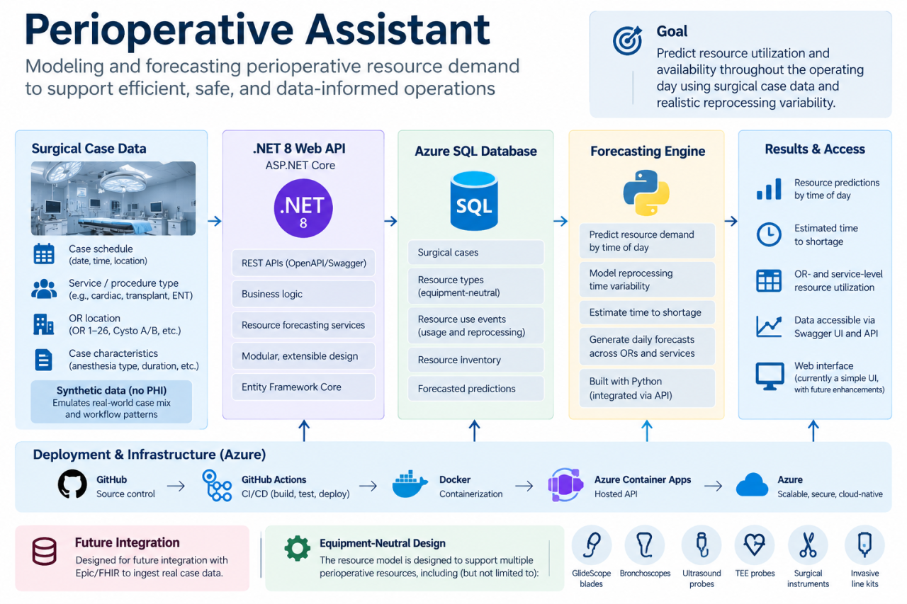

# Perioperative Assistant

Perioperative Assistant is a cloud-native application for forecasting perioperative resource demand and availability from the daily surgical schedule.

The project is built around a practical operating-room problem: reusable clinical resources may be consumed faster than they return from reprocessing, creating periods of limited availability. Perioperative Assistant is designed to combine scheduled case demand, current inventory, and reprocessing turnaround to identify potential shortages before they occur.

The initial use case focuses on forecasting daily demand and availability for reusable GlideScope blades. The underlying domain model is intentionally equipment-neutral so the same architecture can later support other perioperative resources.



> **Project status:** Active development. Cloud infrastructure, CI/CD, the core API, Azure SQL persistence, and the resource-forecasting domain model are operational. Current development is focused on daily surgical-schedule ingestion and the forecasting pipeline.

## Current Goal

The first functional milestone is:

> Given a synthetic daily surgical schedule, predict time-dependent GlideScope Size 3 and Size 4 demand, account for available inventory and uncertain reprocessing turnaround, and identify periods when inventory is at risk of falling below an operational reserve.

The application is intended to operate on a daily schedule once the day's surgical cases are sufficiently populated.

The forecasting model will distinguish between:

- expected demand from scheduled cases
- uncertainty in whether and when a resource will be required
- current available inventory
- resources temporarily unavailable for reprocessing
- expected reprocessing return times
- an operational reserve for emergent and unplanned demand

The initial objective is not perfect case-by-case prediction, but a sufficiently accurate and conservative forecast to support useful resource-planning decisions.

## Architecture

```text
Synthetic Surgical Schedule
        |
        v
Schedule Ingestion / Validation
        |
        v
Perioperative Assistant API
        |
        +---- Surgical Cases
        |
        +---- Resource Types
        |
        +---- Resource Inventory
        |
        +---- Resource Use Events
        |
        +---- Resource Predictions
        |
        v
Forecasting Service
        |
        v
Projected Resource Availability
        |
        v
Reserve / Shortage Risk
```

The application is designed around a stable internal operational model rather than coupling forecasting logic directly to a particular source system.

During development, surgical schedules are produced by a separate Python synthetic-data generator. A future interoperability layer could map approved HL7/FHIR-derived data into the same internal model without requiring the forecasting engine to be redesigned.

## Privacy and Data Design

The project follows a patient-minimal approach.

Synthetic development data does not contain real patient information or protected health information (PHI). The internal forecasting model is designed to retain operational information only when it is relevant to resource forecasting.

The application does not attempt to reproduce an EHR data model. Future healthcare-system integrations would map only the information required by the forecasting workflow into the application's internal domain model.

## Current Domain Model

The core resource-forecasting model currently includes:

### `SurgicalCase`

Represents the operational characteristics of a scheduled surgical case, including location, service, procedure, anesthesia type, and scheduled timing.

### `ResourceType`

Defines an equipment-neutral perioperative resource and its operational characteristics, including whether it is reusable, consumable, or requires reprocessing.

### `ResourceInventory`

Tracks quantities of a resource available at a location.

### `ResourceUseEvent`

Represents observed resource consumption and, for reusable equipment, its progression through unavailability and reprocessing.

### `ResourcePrediction`

Stores predicted resource demand for a surgical case, including probability, expected quantity, predicted time of use, and model version.

This design allows the forecasting architecture to expand beyond GlideScope blades without requiring a resource-specific database redesign.

## Synthetic Data Pipeline

A companion Python project generates synthetic perioperative schedules for development and testing.

The current generator creates a single operational day containing approximately 85–90 surgical cases distributed across simulated OR and procedural locations.

It models:

- room and service assignments
- procedure types
- scheduled start times
- scheduled case durations
- simulated actual start and end times
- turnover between cases
- schedule delays and propagation
- unique synthetic case identifiers
- validation for duplicate cases and same-room overlaps

Scheduled information and simulated actual outcomes are intentionally separable. This allows the application to make forecasts using only information that would have been available at the beginning of the day while retaining simulated outcomes for later model evaluation.

No real patient data is used.

## Technology Stack

| Area | Technology |
|---|---|
| Backend | .NET 8 Web API / C# |
| ORM | Entity Framework Core |
| Database | Azure SQL |
| Cloud Hosting | Azure Container Apps |
| Containerization | Docker |
| Container Registry | GitHub Container Registry |
| CI/CD | GitHub Actions |
| API Documentation | Swagger / OpenAPI |
| Synthetic Data | Python, pandas, NumPy |
| Logging / Cloud Operations | Azure |
| Future Interoperability | HL7 / FHIR |

## Cloud and DevOps

The application currently has a working cloud deployment pipeline:

```text
GitHub
   |
   v
GitHub Actions
   |
   +--> Build .NET application
   |
   +--> Build Docker image
   |
   +--> Push image to GHCR
   |
   v
Azure Container Apps
   |
   v
Perioperative Assistant API
   |
   v
Azure SQL
```

Pushes to the deployment workflow can build and publish a new container image and deploy a new Azure Container Apps revision.

Application secrets and database credentials are kept outside source control.

## Live API

A development deployment is hosted on Azure Container Apps.

**Swagger / OpenAPI:**  
https://perioperativeassistant.proudmoss-12b123ab.westus3.azurecontainerapps.io/swagger

Swagger is currently exposed to support development, testing, and portfolio demonstration. This configuration is not intended to represent the security configuration of a production clinical deployment.

## Repository Structure

```text
PerioperativeAssistant/
|
├── Controllers/
├── Data/
├── DTOs/
├── Migrations/
├── Models/
├── Properties/
├── wwwroot/
|
├── Program.cs
├── Dockerfile
├── .dockerignore
├── PerioperativeAssistant.csproj
|
└── .github/
    └── workflows/
        └── deploy.yml
```

The project structure will expand as ingestion, forecasting services, automated testing, and resource simulation are implemented.

## Development Status

### Completed

- .NET 8 Web API
- Azure Container Apps deployment
- Azure SQL integration
- Entity Framework Core migrations
- Docker containerization
- GitHub Container Registry integration
- GitHub Actions CI/CD
- automated Azure Container Apps revision deployment
- Swagger / OpenAPI documentation
- patient-minimal `SurgicalCase` model
- equipment-neutral resource domain model
- resource inventory model
- resource-use and reprocessing lifecycle model
- resource prediction model
- synthetic daily surgical-schedule generator
- scheduled-versus-actual synthetic case simulation

### Current Development

**Daily surgical-schedule ingestion**

The next application layer will accept a daily surgical schedule through a defined ingestion boundary, validate and normalize incoming cases, and persist them into the operational model.

The synthetic data source is intentionally being treated as an external system so that source-specific adapters can later be replaced without changing the forecasting domain.

### Next Milestones

1. Implement daily surgical-schedule ingestion
2. Add schedule update/upsert handling
3. Generate synthetic resource-use events
4. Model GlideScope Size 3 and Size 4 demand
5. Model variable reprocessing turnaround
6. Combine predicted demand, inventory, and expected resource returns
7. Calculate reserve and shortage risk throughout the surgical day
8. Compare predictions with simulated actual outcomes
9. Add automated unit and integration tests
10. Build an operational dashboard

## Future Development

Planned areas of exploration include:

- statistical and machine-learning demand prediction
- model calibration and prediction evaluation
- configurable safety reserves for unplanned demand
- additional reusable and consumable perioperative resources
- improved observability and monitoring
- automated testing in CI/CD
- authentication and role-based access
- clinician-oriented dashboards
- HL7/FHIR-based integration adapters
- integration with approved clinical scheduling and operational data sources

The long-term architecture is intended to support multiple resource types without coupling the forecasting system to GlideScope equipment or to a single clinical data source.

## Author

**Kevin Brodersen**

Healthcare Technology • Cloud & Software Development • Perioperative Workflows

Built as an applied healthcare software and cloud-engineering project combining perioperative domain knowledge with .NET, Azure, Python, data modeling, and predictive analytics.